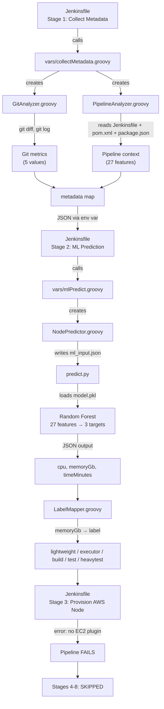

# ML Node Selector — Full Code Audit Report

> Complete line-by-line review of all files in the workspace.
> 10 files reviewed, 2,208 total lines of code.

---

## End-to-End Flow Verification



**Verdict: The flow is logically complete and WILL predict AWS nodes.** ✅

---

## Feature Alignment Check (Critical)

The 27 features must match between Groovy (sender) and Python (receiver):

| # | Groovy key (collectMetadata) | Python feature (predict.py) | Match? |
|---|-----|-----|--------|
| 1 | `projectType` → string ("java") | `project_type` → mapped to int (1) | ✅ |
| 2 | `repoSizeMb` → int | `repo_size_mb` → float | ✅ |
| 3 | `isMonorepo` → 0/1 | `is_monorepo` → int | ✅ |
| 4 | `branchType` → **int** (0-4) | `branch_type` → **⚠️ see bug #2** | ⚠️ |
| 5 | `buildType` → string | `build_type` → 0/1 | ✅ |
| 6 | `environment` → string | `environment` → 0/1/2 | ✅ |
| 7 | `filesChanged` → int | `files_changed` → int | ✅ |
| 8 | `linesAdded` → int | `lines_added` → int | ✅ |
| 9 | `linesDeleted` → int | `lines_deleted` → int | ✅ |
| 10 | `sourceFilesPct` → double | `source_files_pct` → float | ✅ |
| 11 | `depsChanged` → int | `deps_file_changed` → int | ✅ |
| 12 | `dependencyCount` → int | `dependency_count` → int | ✅ |
| 13 | `testFilesChanged` → int | `test_files_changed` → int | ✅ |
| 14 | `stagesCount` → int | `stages_count` → int | ✅ |
| 15 | `hasBuildStage` → 0/1 | `has_build_stage` → int | ✅ |
| 16 | `hasUnitTests` → 0/1 | `has_unit_tests` → int | ✅ |
| 17 | `hasIntegrationTests` → 0/1 | `has_integration_tests` → int | ✅ |
| 18 | `hasE2ETests` → 0/1 | `has_e2e_tests` → int | ✅ |
| 19 | `hasDeployStage` → 0/1 | `has_deploy_stage` → int | ✅ |
| 20 | `hasDockerBuild` → 0/1 | `has_docker_build` → int | ✅ |
| 21 | `usesEmulator` → 0/1 | `uses_emulator` → int | ✅ |
| 22 | `parallelStages` → int | `parallel_stages` → int | ✅ |
| 23 | `hasArtifactPublish` → 0/1 | `has_artifact_publish` → int | ✅ |
| 24 | `isFirstBuild` → 0/1 | `is_first_build` → int | ✅ |
| 25 | `cacheAvailable` → 0/1 | `cache_available` → int | ✅ |
| 26 | `isCleanBuild` → 0/1 | `is_clean_build` → int | ✅ |
| 27 | `timeOfDayHour` → int | `time_of_day_hour` → int | ✅ |

**26/27 features match correctly.** 1 has a warning (see bugs below).

---

## Critical Bugs Found 🔴

### Bug 1: `requirements.txt` path mismatch

[NodePredictor.groovy](file:///c:/Users/dell/Desktop/ML-Node-Selector/src/org/ml/nodeselection/NodePredictor.groovy#L58) installs from `ml/requirements.txt`:
```groovy
// Line 58
'@.venv\\Scripts\\python.exe -m pip install ... -r ml\\requirements.txt'
```

But the file only exists at `resources/requirements.txt`:
```
resources/requirements.txt  ← EXISTS
ml/requirements.txt         ← DOES NOT EXIST
```

> [!CAUTION]
> **This will cause `pip install` to fail**, which means the ML model won't load, and the prediction will fall back to heuristics. The prediction will still work (via fallback), but it won't use the trained Random Forest model.

**Fix:** Either move `resources/requirements.txt` → `ml/requirements.txt`, or update the path in NodePredictor.

---

### Bug 2: `branchType` sent as int, but Python expects string lookup

[PipelineAnalyzer.groovy](file:///c:/Users/dell/Desktop/ML-Node-Selector/src/org/ml/nodeselection/PipelineAnalyzer.groovy#L244) returns `branchType` as an **integer** (0-4):
```groovy
branchType = 2  // Line 254
```

[predict.py](file:///c:/Users/dell/Desktop/ML-Node-Selector/ml/predict.py#L116-L118) first tries to look it up as a **string**:
```python
branch_type_str = context.get('branchType', None)  # Gets int 2
features['branch_type'] = BRANCH_TYPES.get(branch_type_str.lower(), 0)  # ERROR: int has no .lower()
```

> [!WARNING]
> This will crash if `branchType` is an integer. However, the `try/catch` in `predict()` will catch it and fall through to the branch name inference logic (lines 121-132), so it works by accident. But the integer value is lost.

**Fix:** In predict.py, check `if isinstance(branch_type_str, int): features['branch_type'] = branch_type_str`

---

## Warnings ⚠️

### Warning 1: `selectNode.groovy` is dead code

[selectNode.groovy](file:///c:/Users/dell/Desktop/ML-Node-Selector/vars/selectNode.groovy) (262 lines) duplicates the exact same logic as `collectMetadata.groovy` + `mlPredict.groovy` combined. The Jenkinsfile uses `collectMetadata()` + `mlPredict()` — it never calls `selectNode()`.

This file is unused but adds confusion. Consider removing it or marking it as deprecated.

### Warning 2: Model accuracy is moderate

From [features.json](file:///c:/Users/dell/Desktop/ML-Node-Selector/ml/features.json#L36-L40):
```json
"r2_score": 0.6725,     // 67% variance explained
"mae": 13.56,           // Average error ~13.5 units
"cv_mean": 0.615        // Cross-validation: 61.5%
```

For a POC this is acceptable, but in production you'd want R² > 0.85. The model was trained on synthetic data, so real-world accuracy depends on retraining with actual Jenkins build logs.

### Warning 3: `parallelStages` default mismatch

[predict.py line 163](file:///c:/Users/dell/Desktop/ML-Node-Selector/ml/predict.py#L163) defaults `parallel_stages` to **1**, but [collectMetadata.groovy line 135](file:///c:/Users/dell/Desktop/ML-Node-Selector/vars/collectMetadata.groovy#L135) sends `parallelStages: 0` when no parallel is detected.

This means if metadata is missing, Python assumes 1 parallel stage, but Groovy assumes 0. Minor inconsistency.

### Warning 4: `allure` in tools block

The Jenkinsfile `tools` block declares `allure 'Allure-2.34.1'`. If Allure is not installed on the Jenkins controller, the pipeline will fail at tools resolution — **before Stage 1 even runs**.

---

## Code Quality Summary

| File | Lines | Complexity | Issues |
|------|-------|------------|--------|
| [Jenkinsfile](file:///c:/Users/dell/Desktop/ML-Node-Selector/Jenkinsfile) | 236 | Low | Clean 8-stage structure ✅ |
| [collectMetadata.groovy](file:///c:/Users/dell/Desktop/ML-Node-Selector/vars/collectMetadata.groovy) | 182 | Low | Good, displays all features ✅ |
| [mlPredict.groovy](file:///c:/Users/dell/Desktop/ML-Node-Selector/vars/mlPredict.groovy) | 168 | Low | Has fallback heuristics ✅ |
| [selectNode.groovy](file:///c:/Users/dell/Desktop/ML-Node-Selector/vars/selectNode.groovy) | 262 | Low | ⚠️ Duplicate, unused |
| [GitAnalyzer.groovy](file:///c:/Users/dell/Desktop/ML-Node-Selector/src/org/ml/nodeselection/GitAnalyzer.groovy) | 222 | Low | Good error handling ✅ |
| [PipelineAnalyzer.groovy](file:///c:/Users/dell/Desktop/ML-Node-Selector/src/org/ml/nodeselection/PipelineAnalyzer.groovy) | 667 | Medium | Dynamic detection ✅ |
| [NodePredictor.groovy](file:///c:/Users/dell/Desktop/ML-Node-Selector/src/org/ml/nodeselection/NodePredictor.groovy) | 109 | Low | 🔴 Wrong requirements path |
| [LabelMapper.groovy](file:///c:/Users/dell/Desktop/ML-Node-Selector/src/org/ml/nodeselection/LabelMapper.groovy) | 79 | Low | Clean mapping logic ✅ |
| [predict.py](file:///c:/Users/dell/Desktop/ML-Node-Selector/ml/predict.py) | 283 | Medium | 🔴 branchType int bug |
| [features.json](file:///c:/Users/dell/Desktop/ML-Node-Selector/ml/features.json) | 41 | Low | 27 features match ✅ |

---

## Final Verdict

> [!IMPORTANT]
> **YES, this POC WILL predict AWS nodes.** The end-to-end flow is logically complete:
> metadata → 27 features → Random Forest → CPU/Memory/Time → LabelMapper → AWS node label.
>
> However, **2 bugs must be fixed** for the ML model to actually run (instead of falling back to heuristics):
> 1. Move `resources/requirements.txt` → `ml/requirements.txt`
> 2. Fix `branchType` int handling in `predict.py`
