# ML Node Selector - Complete Flow Documentation

## Overview

The ML Node Selector is a Jenkins shared library that uses machine learning to predict optimal CI/CD resource requirements. It analyzes code changes, project type, and pipeline configuration to recommend the right Jenkins agent (node) size.

---

## Architecture Diagram


---

## Component Overview

| Component | Location | Purpose |
|-----------|----------|---------|
| `selectNode.groovy` | `vars/` | Main entry point, orchestrates flow |
| `GitAnalyzer.groovy` | `src/org/ml/nodeselection/` | Extracts git metrics |
| `PipelineAnalyzer.groovy` | `src/org/ml/nodeselection/` | Detects project type, pipeline config |
| `NodePredictor.groovy` | `src/org/ml/nodeselection/` | Runs Python ML prediction |
| `LabelMapper.groovy` | `src/org/ml/nodeselection/` | Maps predictions to Jenkins labels |
| `predict.py` | `ml/` | Python ML inference script |
| `model.pkl` | `ml/` | Trained Random Forest model |

---

## Detailed Flow

### Step 0: Pipeline Calls selectNode

```groovy
// In Jenkinsfile
@Library('ml-node-selector') _

pipeline {
    agent none
    
    stages {
        stage('Select Node') {
            steps {
                script {
                    def result = selectNode(buildType: 'release')
                    env.SELECTED_LABEL = result.label
                }
            }
        }
        
        stage('Build') {
            agent { label env.SELECTED_LABEL }
            steps {
                // Build runs on optimal node
            }
        }
    }
}
```

---

### Step 1: Git Analysis

**File:** `src/org/ml/nodeselection/GitAnalyzer.groovy`


**What it does:**
1. Runs `git diff --numstat HEAD~1` to get change statistics
2. Counts files changed, lines added/deleted
3. Detects if dependency files changed (package.json, requirements.txt)
4. Gets current branch name

**Output:**
```groovy
[
    filesChanged: 12,
    linesAdded: 350,
    linesDeleted: 50,
    depsChanged: 1,
    branch: "feature/auth"
]
```

---

### Step 2: Pipeline Analysis

**File:** `src/org/ml/nodeselection/PipelineAnalyzer.groovy`


**What it detects:**

| Feature | How Detected |
|---------|--------------|
| `projectType` | Check for package.json, build.gradle, requirements.txt, Podfile |
| `isMonorepo` | Check for lerna.json, pnpm-workspace.yaml, multiple package.json |
| `hasE2ETests` | Search Jenkinsfile for appium/selenium/detox/cypress |
| `usesEmulator` | Search for emulator/simulator/avd keywords |
| `hasDockerBuild` | Check for Dockerfile or docker-compose.yml |
| `cacheAvailable` | Check if node_modules/.gradle/.venv exists |
| `isFirstBuild` | Check if BUILD_NUMBER == 1 |
| `dependencyCount` | Count dependencies in package.json/requirements.txt |

**Output (27 features):**
```groovy
[
    projectType: "react-native",
    repoSizeMb: 250,
    isMonorepo: 0,
    branchType: 0,  // feature
    buildType: "release",
    environment: "development",
    
    // Git metrics
    filesChanged: 12,
    linesAdded: 350,
    linesDeleted: 50,
    sourceFilesPct: 0.8,
    depsChanged: 1,
    dependencyCount: 150,
    testFilesChanged: 3,
    
    // Pipeline structure
    stagesCount: 5,
    hasBuildStage: 1,
    hasUnitTests: 1,
    hasIntegrationTests: 0,
    hasE2ETests: 1,
    hasDeployStage: 1,
    hasDockerBuild: 0,
    usesEmulator: 1,
    parallelStages: 2,
    hasArtifactPublish: 1,
    
    // Cache state
    isFirstBuild: 0,
    cacheAvailable: 1,
    isCleanBuild: 0,
    
    // Time
    timeOfDayHour: 14
]
```

---

### Step 3: ML Prediction

**Files:** 
- `src/org/ml/nodeselection/NodePredictor.groovy` (Groovy wrapper)
- `ml/predict.py` (Python inference)
- `ml/model.pkl` (Trained model)


**Feature Engineering in predict.py:**

```python
# Convert input context to 27 ML features
features = {
    'project_type': PROJECT_TYPES.get(context['projectType'], 0),
    'repo_size_mb': context.get('repoSizeMb', 100),
    'is_monorepo': context.get('isMonorepo', 0),
    # ... 24 more features
}

# Run prediction
X = [[features[col] for col in FEATURE_COLUMNS]]
prediction = model.predict(X)[0]  # [cpu, memory, time]
```

**Output:**
```json
{
    "cpu": 87.3,
    "memoryGb": 13.28,
    "timeMinutes": 106.1,
    "method": "ml_enhanced_prediction",
    "confidence": "medium"
}
```

---

### Step 4: Label Mapping

**File:** `src/org/ml/nodeselection/LabelMapper.groovy`


**Mapping Logic:**

| Predicted Memory | Jenkins Label | AWS Instance | vCPU | RAM |
|-----------------|---------------|--------------|------|-----|
| < 4 GB | `aws-small` | t3.medium | 2 | 4 GB |
| 4-8 GB | `aws-medium` | t3.large | 2 | 8 GB |
| 8-16 GB | `aws-large` | t3.xlarge | 4 | 16 GB |
| > 16 GB | `aws-xlarge` | t3.2xlarge | 8 | 32 GB |

---

### Step 5: Return to Pipeline

**File:** `vars/selectNode.groovy`

```groovy
// Set environment variables
env.ML_SELECTED_LABEL = label         // "aws-large"
env.ML_PREDICTED_MEMORY = "13.28"
env.ML_PREDICTED_CPU = "87.3"
env.ML_PREDICTED_TIME = "106.1"
env.ML_PROJECT_TYPE = "react-native"

// Return full result
return [
    label: "aws-large",
    instanceType: "t3.xlarge",
    predictedMemoryGb: 13.28,
    predictedCpu: 87.3,
    predictedTimeMinutes: 106.1,
    confidence: "medium"
]
```

---

## Complete Flow Diagram


---

## Example Scenarios

### Scenario 1: Light Python Build

```
Input:
  - Project: Python
  - Tests: Unit only
  - Cache: Available
  - Files Changed: 3

ML Prediction:
  - CPU: 53%
  - Memory: 3.2 GB
  - Time: 17 min

Node Selection:
  - Label: aws-small (t3.medium)
  
Cost Savings: Uses small instance instead of default large
```

### Scenario 2: Heavy React Native Build

```
Input:
  - Project: React Native
  - Tests: E2E with Appium
  - Emulator: Yes
  - Build Type: Release
  - Files Changed: 50

ML Prediction:
  - CPU: 87%
  - Memory: 13.3 GB
  - Time: 106 min

Node Selection:
  - Label: aws-large (t3.xlarge)
  
Why: E2E tests with emulator need high memory
```

---

## Training Flow (Offline)

```mermaid
flowchart LR
    subgraph Data["📊 Data Generation"]
        A[Kaggle CI/CD Logs] --> B[generate_enhanced_dataset.py]
        B --> C[enhanced_training_data.csv]
        C --> D[1000+ records, 27 features]
    end
    
    subgraph Training["🧠 Model Training"]
        D --> E[train_model.py]
        E --> F[RandomForestRegressor]
        F --> G[model.pkl]
        F --> H[features.json]
    end
    
    subgraph Deploy["📦 Deployment"]
        G --> I[Copy to ml/ folder]
        H --> I
        I --> J[Jenkins Shared Library]
    end
```



---

## File Structure

```
ML-Node-Selector/
├── vars/
│   └── selectNode.groovy          # Main entry point
├── src/org/ml/nodeselection/
│   ├── GitAnalyzer.groovy         # Git metrics extraction
│   ├── PipelineAnalyzer.groovy    # Project/pipeline detection
│   ├── NodePredictor.groovy       # ML prediction wrapper
│   └── LabelMapper.groovy         # Memory → Label mapping
├── ml/
│   ├── model.pkl                  # Trained model (4.6 MB)
│   ├── predict.py                 # Python inference
│   ├── features.json              # Feature metadata
│   └── requirements.txt           # Python dependencies
├── resources/
│   ├── generate_enhanced_dataset.py  # Data generation
│   ├── train_model.py             # Model training
│   ├── enhanced_training_data.csv # Training data
│   └── training_features.csv      # Feature-only data
└── docs/
    ├── FLOW_DOCUMENTATION.md      # This file
    ├── EDGE_CASE_ANALYSIS.md      # Edge cases
    └── ENHANCED_DATASET_IMPLEMENTATION_PLAN.md
```

---

## Summary

1. **Pipeline calls** `selectNode(buildType: 'release')`
2. **GitAnalyzer** extracts code change metrics
3. **PipelineAnalyzer** detects project type, pipeline config, cache state
4. **NodePredictor** runs Python ML prediction with 27 features
5. **RandomForest model** predicts CPU, Memory, Build Time
6. **LabelMapper** converts memory prediction to Jenkins label
7. **Pipeline** runs on the optimal node!

**Result:** Right-sized infrastructure for every build = cost savings + faster builds!
