# Random Forest Prediction - How It Works

## Overview

Your ML Node Selector uses a **Random Forest Regressor** to predict three resource values:
- **CPU Usage (%)** - Expected CPU utilization
- **Memory (GB)** - Expected memory consumption  
- **Build Time (minutes)** - Expected build duration

---

## Block Diagram: Complete Flow

```mermaid
flowchart TB
    subgraph Input["📥 INPUT: Git Metrics"]
        A1[files_changed]
        A2[lines_added]
        A3[lines_deleted]
        A4[deps_changed]
        A5[branch]
        A6[build_type]
    end

    subgraph Feature["⚙️ FEATURE ENGINEERING"]
        B1["net_lines = added - deleted"]
        B2["total_changes = added + deleted"]
        B3["code_density = changes / files"]
        B4["is_main = branch in main/master"]
        B5["is_release = type in release"]
    end

    subgraph RF["🌲 RANDOM FOREST MODEL"]
        direction TB
        T1["🌳 Tree 1"]
        T2["🌳 Tree 2"]
        T3["🌳 Tree 3"]
        T4["🌳 ..."]
        T5["🌳 Tree 100"]
        
        T1 --> AVG
        T2 --> AVG
        T3 --> AVG
        T4 --> AVG
        T5 --> AVG
        AVG["📊 Average All Trees"]
    end

    subgraph Output["📤 OUTPUT: Predictions"]
        C1["CPU: 45.2%"]
        C2["Memory: 2.5 GB"]
        C3["Time: 8.3 min"]
    end

    subgraph Mapping["🏷️ LABEL MAPPING"]
        D1{"Memory > 16GB?"}
        D2["heavytest"]
        D3{"Memory > 8GB?"}
        D4["test"]
        D5{"Memory > 2GB?"}
        D6["build"]
        D7["executor/lightweight"]
    end

    Input --> Feature
    Feature --> RF
    RF --> Output
    Output --> Mapping
    
    D1 -->|Yes| D2
    D1 -->|No| D3
    D3 -->|Yes| D4
    D3 -->|No| D5
    D5 -->|Yes| D6
    D5 -->|No| D7
```



---

## How Random Forest Works

### 1. Training Phase (train_model.py)


### 2. Each Decision Tree

A single decision tree makes decisions like this:


### 3. Why "Forest"?

```
                    Input Features
                          ↓
    ┌─────────────────────┼─────────────────────┐
    ↓                     ↓                     ↓
┌───────┐           ┌───────┐           ┌───────┐
│Tree 1 │           │Tree 2 │           │Tree N │
│CPU:40%│           │CPU:50%│    ...    │CPU:45%│
│Mem:2GB│           │Mem:3GB│           │Mem:2GB│
└───────┘           └───────┘           └───────┘
    ↓                     ↓                     ↓
    └─────────────────────┼─────────────────────┘
                          ↓
                  AVERAGE ALL TREES
                          ↓
                Final: CPU=45%, Mem=2.3GB
```

**Why use multiple trees?**
- Single tree can overfit (memorize training data)
- Multiple trees with random samples = better generalization
- Averaging reduces prediction variance

---

## Feature Importance

The model learns which features matter most:

| Feature | Importance | Why It Matters |
|---------|------------|----------------|
| `total_changes` | ~25% | More changes = more compilation |
| `lines_added` | ~20% | New code needs processing |
| `files_changed` | ~15% | More files = more I/O |
| `is_release` | ~12% | Release builds are heavier |
| `code_density` | ~10% | Dense changes need more memory |
| `deps_changed` | ~8% | Dependency updates are heavy |
| `is_main` | ~5% | Main branch builds are thorough |
| `net_lines` | ~3% | Net additions vs deletions |
| `lines_deleted` | ~2% | Deletions are lightweight |

---

## Prediction Flow in Your Project


---

## Model Parameters

From your `train_model.py`:

```python
RandomForestRegressor(
    n_estimators=100,     # 100 decision trees
    max_depth=10,         # Each tree max 10 levels deep
    random_state=42,      # Reproducible results
    n_jobs=-1             # Use all CPU cores
)
```

| Parameter | Value | Meaning |
|-----------|-------|---------|
| `n_estimators` | 100 | Number of trees in forest |
| `max_depth` | 10 | Max decisions per tree path |
| `random_state` | 42 | Seed for reproducibility |
| `n_jobs` | -1 | Parallel training on all cores |

---

## Summary

```
┌─────────────────────────────────────────────────────────────┐
│                    YOUR ML PIPELINE                         │
├─────────────────────────────────────────────────────────────┤
│                                                             │
│  Git Metrics ──► Feature Eng ──► Random Forest ──► Labels  │
│                                                             │
│  9 features       5 derived      100 trees        5 AWS    │
│  from git         features       averaged         instances│
│                                                             │
└─────────────────────────────────────────────────────────────┘
```
